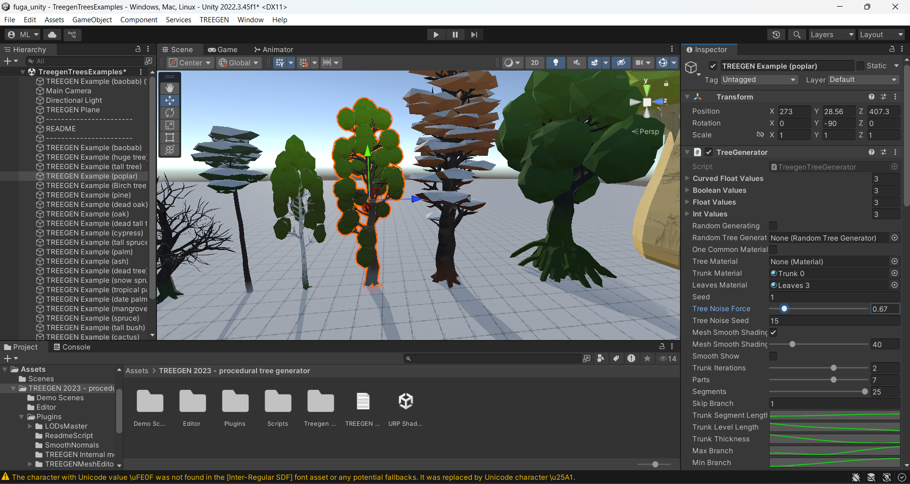

# Abdel Ali Djeral

 

 ## Réalisations

 <!-- Une image par semaine de la réalisation dont tu es le plus fier avec une légende -->

### Semaine 1
Gestion du projet (issues GitHub), compléter certaines parties du site web (la plantation, l'invenatire multimédia, le scénario et les assets) et comprendre en détails l'outils génératif
* 
  
### Semaine 2
Le code Unity (Mapping, gestion des données sur Unity, Coder certaines fonctionalités comme le clone et sauvegarder les données  )
* 
