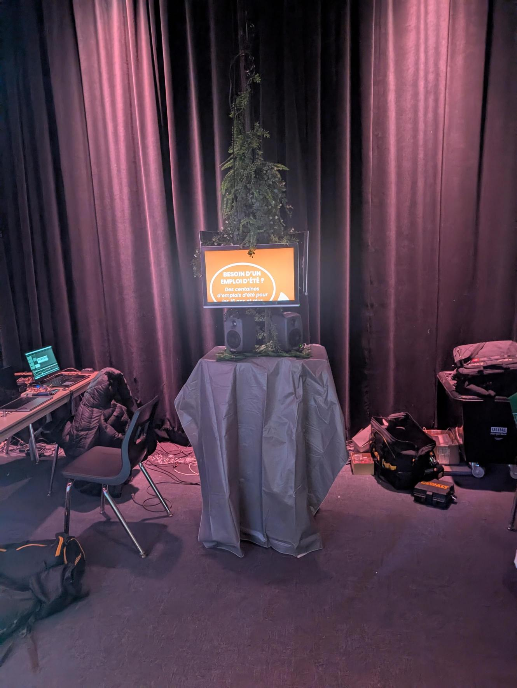

# Daniel Dezemma
 
## Réalisations
 <!-- Une image par semaine de la réalisation dont tu es le plus fier avec une légende -->
### semaine 1
Conception du projet sur Github (La section des membres d'équipe, la liste des logiciels utilisés, le texte sur les trois questions sur notre projet) 
 
### semaine 2
Réalisation du montage de la vidéo d'intention
 
### semaine 3
Correction du montage de la vidéo d'intention

### semaine 4 
Installation physique de l'espace (écrans)

### semaine 5
Installation des haut-parleurs et lumières de l'installation physique

### semaine 6 (jeudi)
Configuration des lumières sur QLC+ et réalisation du montage de la vidéo making of

### semaine 7
Réalisation du montage de la vidéo making of (ancienne version)

