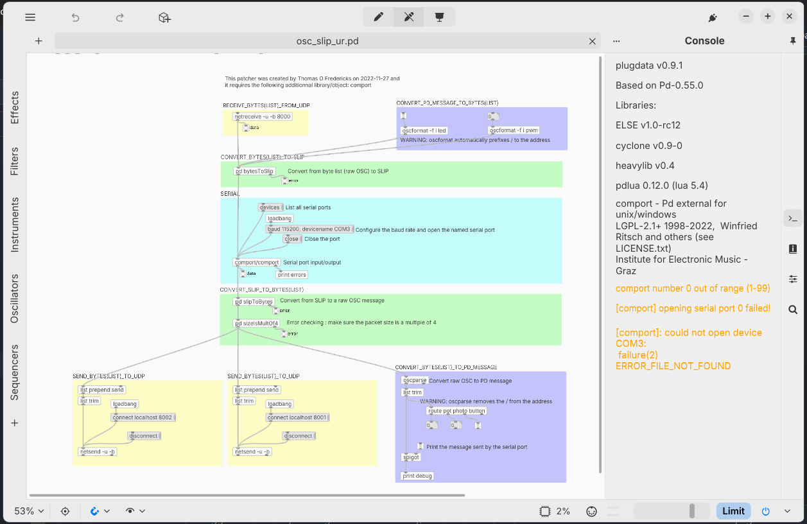

# Matis Labelle

 

 ## Réalisations

 <!-- Une image par semaine de la réalisation dont tu es le plus fier avec une légende -->
### Semaine 1
Gestion du projet (issues GitHub) et trouver l'outil de génération d'arbre.
* 

### Session 2
Gestion de projet Github, Établir la connection entre Plug Data, Reaper et Unity. 
* 
