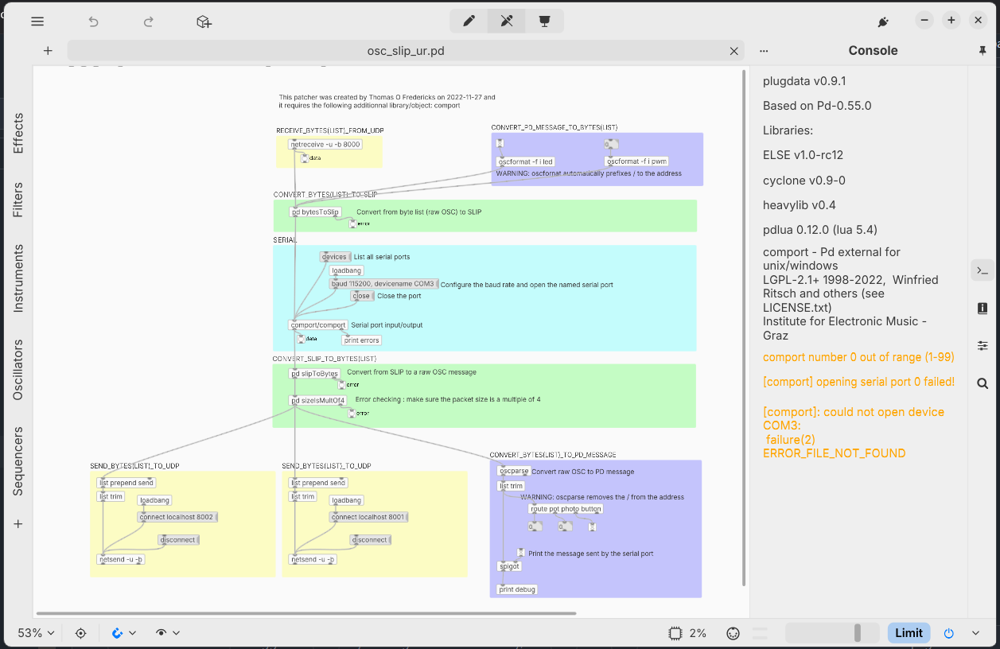
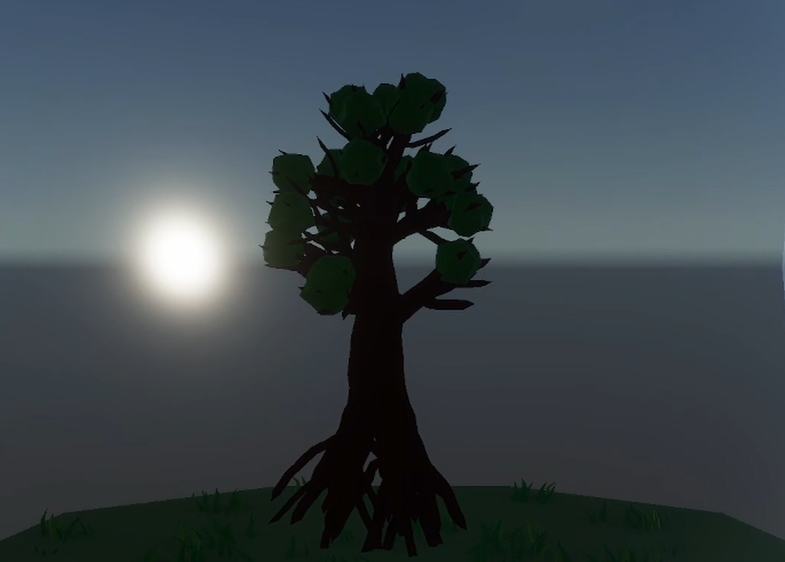
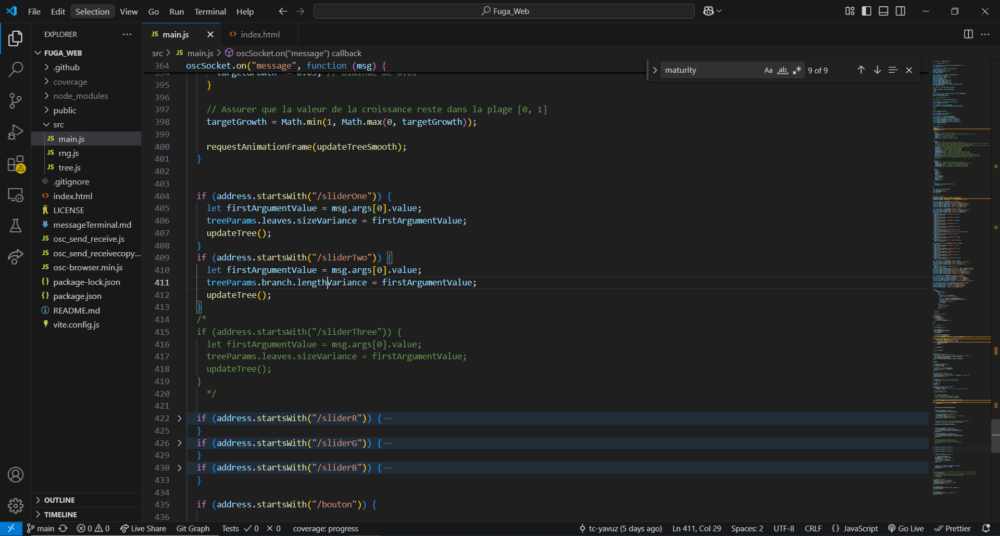

# Matis Labelle
 

 ## Réalisations

 <!-- Une image par semaine de la réalisation dont tu es le plus fier avec une légende -->

### Semaine 1
Gestion du projet (issues GitHub) et trouver l'outil de génération d'arbre.
* 
  
### Semaine 2
Gestion de projet Github, Établir la connection entre Plug Data, Reaper et Unity. 
* 

### Semaine 3
Animation et fluidification de l'abre qui pousse
* 

### Semaine 4
Récupere et connecter les données envoyées par nos sliders, encoders et boutons avec les paramètres de l'arbre sur le Tree.js.
* 

### Semaine 5
Connection UDP des 3 nouveaux Atom vers les deux ordinateurs.
* 
