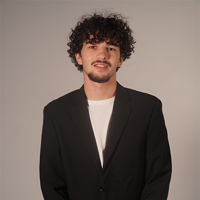
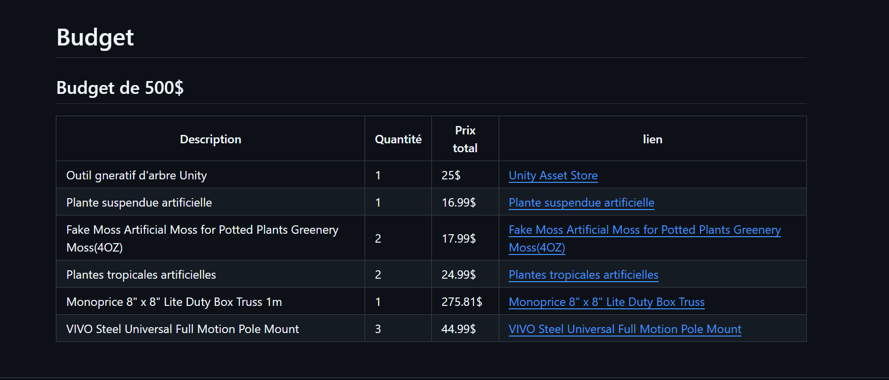
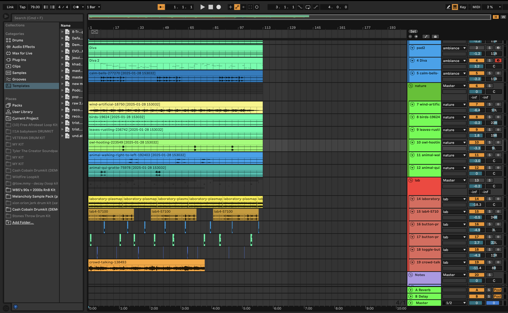
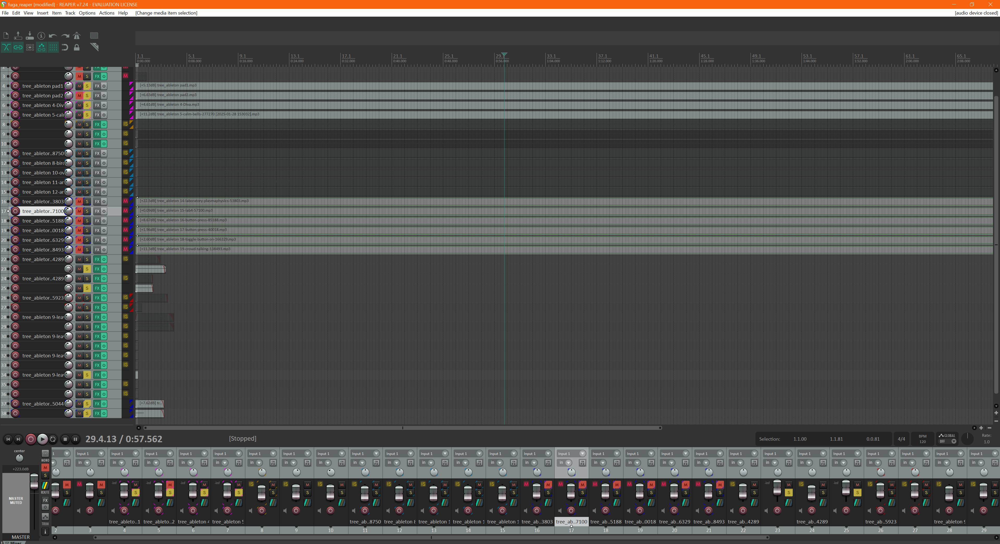
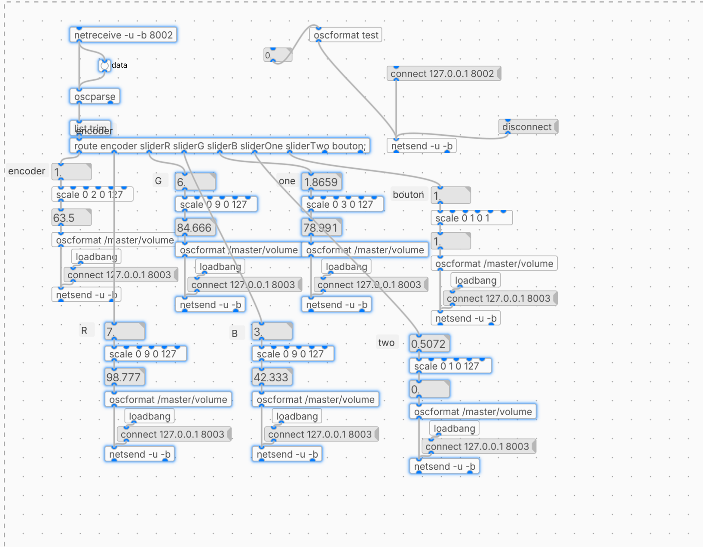
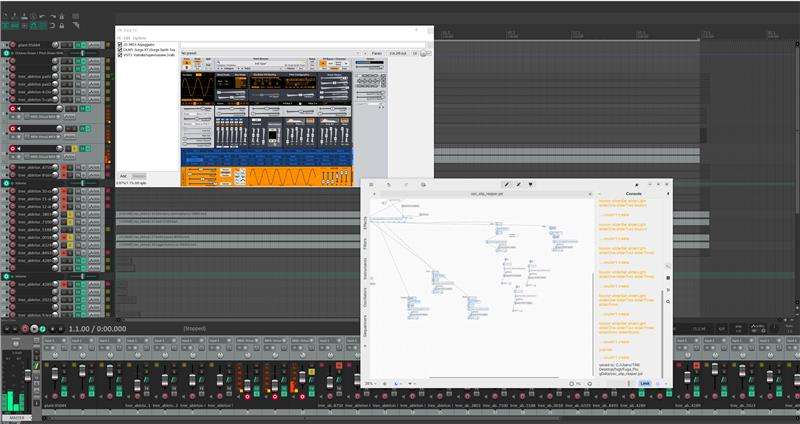
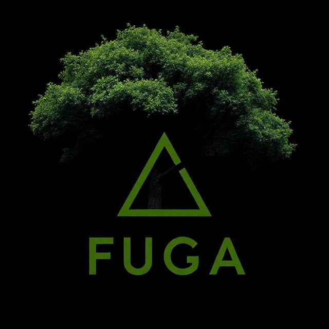

# Tristan Khadka
 
### Réalisations
## semaine 1
Conception du projet sur Github 
1. Devis
2. Budget
3. Simulation
4. Ambiance
* 
## semaine 2
Design et ambiance sonore sur Ableton 
* 
* ## semaine 3
Mixing sur Reaper et créations de sons et leur variantes
* 
* ## semaine 4
Implémantation des sons et leurs données sur Plugdata
* 
  * ## semaine 5
continuer le mapping et design sonore mixant reaper et pluggdata pour l'interactivité
* 
   * ## semaine 6
Création et design du Logo Fuga et continuation du mapping sonore.
* 
