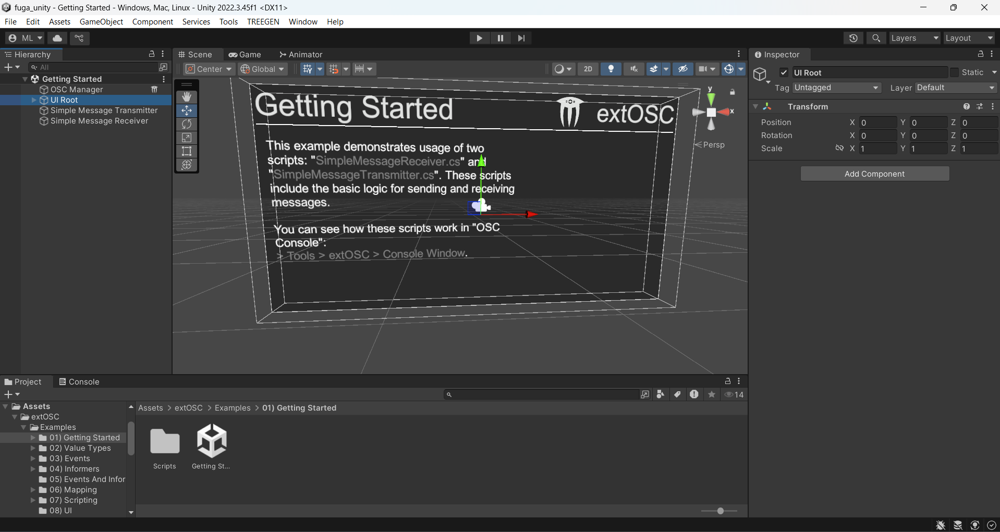
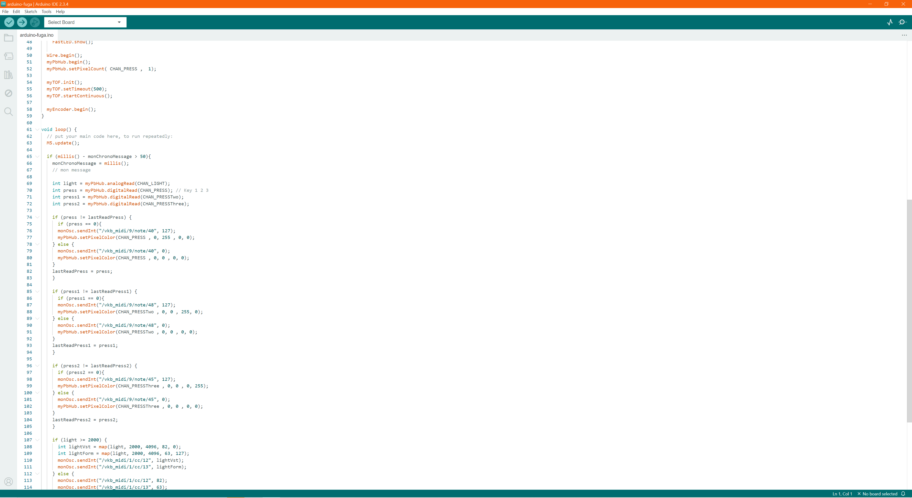
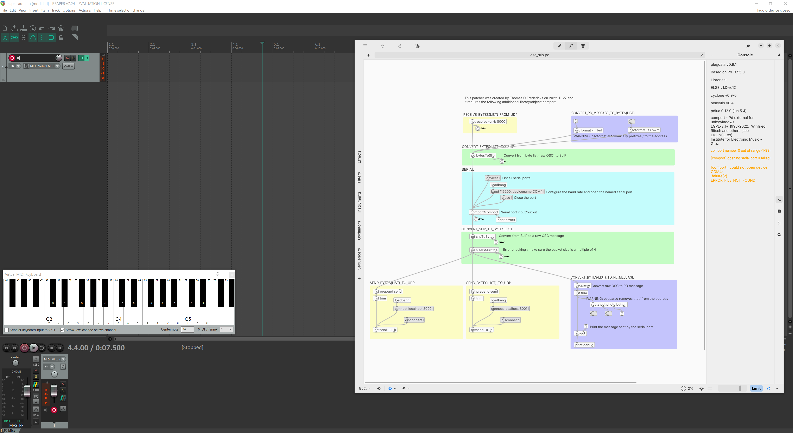
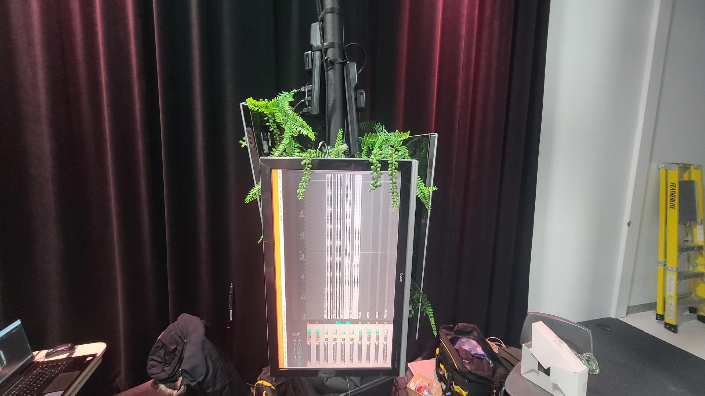
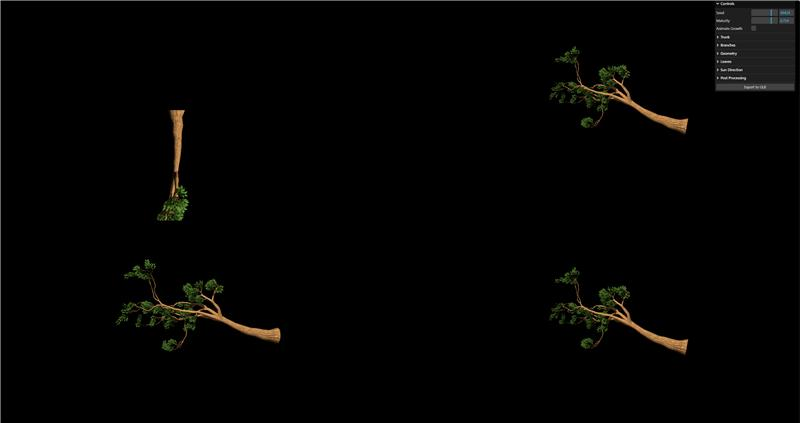
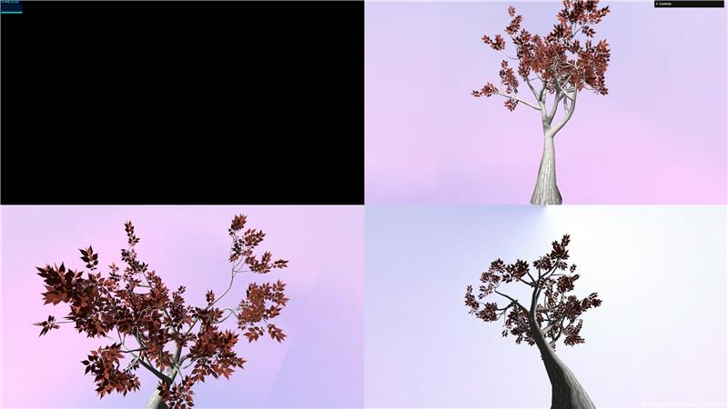

# Yavuz-Selim Gucluer

 

## Réalisations

 <!-- Une image par semaine de la réalisation dont tu es le plus fier avec une légende -->
### Semaine 1
Devis, Scénarimage et trouver le plug-in d'OSC dans unity.

-----------------------------

### Semaine 2
Comprendre comment fonctionne le plug-in extOSC dans Unity, le code Arduino, les deux ports Plug-Data pour Reaper et Unity, et commencer la modélisation 3D.

-----------------------------

### Semaine 3
Configurer le splicing pour afficher sur 3 écrans différents.

-----------------------------

### Semaine 4
Ajouter des caméras sur Three.js pour avoir différents points de vue de l'arbre (devant, droite, gauche). Cela sera divisé sur les 3 écrans avec un spliter.

-----------------------------

### Semaine 5
J'ai modifié la position des caméras pour obtenir une meilleure perspective de l'arbre et j'ai ajouté un arrière-plan HDRI.

-----------------------------
