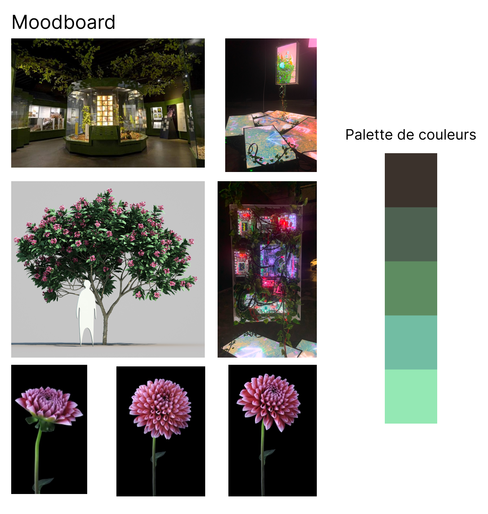

# Ambiance

Découvrez l'ambiance visuelle et sonore de Fuga.

## Visuels

Voici un visuel qui représentent l'atmosphère du projet :

## Ambiance visuelle

l'ambiance visuelle qui accompagne le projet :

- [Magic Mushroom Forest | Trippy Animation](https://youtu.be/iFTr0yS2rG8)
- [Realistic Tree Grow 3d Model | Procedural HIP Setup + Alembic Files (Animated)](https://youtu.be/MfMhxoc8SZ8)
- [MAYA 3D - Reconstructions of the Mayan World](https://youtu.be/uCa-6X-3IF4)

## Ambiance sonore

Écoutez l'ambiance sonore qui accompagne le projet :

- [The ambient drones of Bill Baxter - Procyon (2024)](https://www.youtube.com/watch?v=zJt2nbWQCUU)
- [Teebs](https://youtu.be/VDRJk6N6OoY?list=PLqvkS10cUjZ7n3RZU7nnOQ9BncYkIN_XT)
- [Chihei Hatakeyama - Ferrum](https://youtu.be/ZMmScn1DEYk?list=PLEBwBR_8DKbzrodgESXXBUMhtzwBh2VpJ)

<!--
Note : Découvrez plus d'informations sur l'**[Ambiance du projet ici](https://tim-montmorency.com/582523-gestion/#/contenus/2_scenarisation/30_ambiances/)**.
-->
