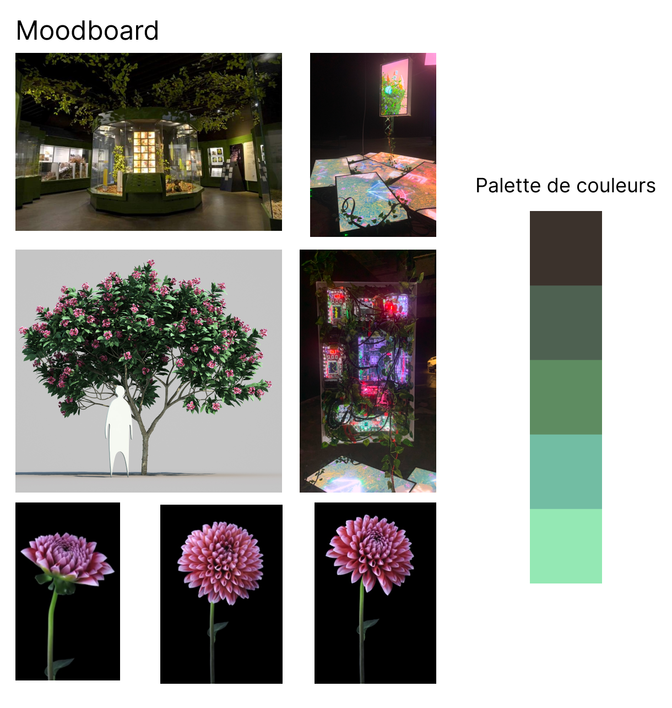

# Ambiance

Découvrez l'ambiance visuelle et sonore de Fuga.

## Visuels

Voici quelques visuels qui représentent l'atmosphère du projet :

## Ambiance Sonore

Écoutez l'ambiance sonore qui accompagne le projet :

- [Ambiance 1](https://link-vers-son-1.com)
- [Ambiance 2](https://link-vers-son-2.com)
- [Ambiance 3](https://link-vers-son-3.com)

<!--
Note : Découvrez plus d'informations sur l'**[Ambiance du projet ici](https://tim-montmorency.com/582523-gestion/#/contenus/2_scenarisation/30_ambiances/)**.
-->
