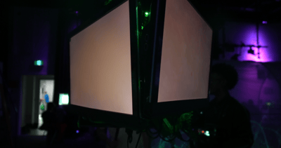
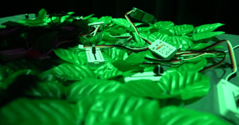

# Maquette
Pour avoir une bonne maquette, on s'est assuré que les éléments les plus essentiels du projet fonctionnent notamment la génération d'arbre qui fonctionne avec les sliders M5stack. Le son n'est pas encore fini et connecté aux données qui contrôlent le modèle d'arbre génératif. On a encore des problèmes de FPS donc la génération n'est pas totalement fluide et on travaille encore sur l'aspect physique de notre installation. Mais d'ici la fin du projet, on doit s'assurer que la communication UDP permet d'envoyer les données entre deux ordinateurs distincts puis que l'un de ces ordinateurs gère la section web du projet, tandis que l'autre est dédié à la gestion du son. Les données sont ensuite traitées via PlugData, un environnement spécialisé permettant de recevoir et de manipuler les informations nécessaires. Enfin, grâce à l'intégration du websocket d'OSCBridge, les données sont transmises vers nos pages web, qui prennent en charge le contrôle de l'arbre interactif. Le projet sera donc finalement complet et près à être présenté au grand publique.

## Gallerie d'images

## Vidéo du la maquette en action

