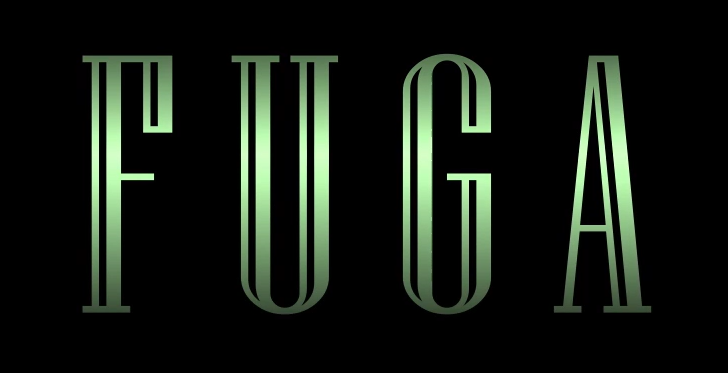
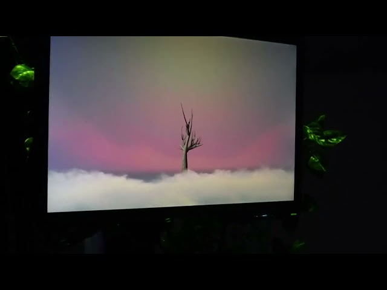

# Diffusion

Documentation du projet finalisé 

## Video d'intention
 

## Video finale 
 

## Manuel d'instruction pour opération

1. Lancer le code sur PlugData
2. Ouvrir OscBridge
3. Ouvrir Reaper
4. Ouvrir le terminal sur VsCode et insérer ce code: *npm install* et *npm run dev*
5. Lancer OBS et actualiser les groupes ainsi que les pages de chaques arbres
6. Ouvrir QLC+ et activer le mode play et utiliser les boutons et sliders dans le virtual console
