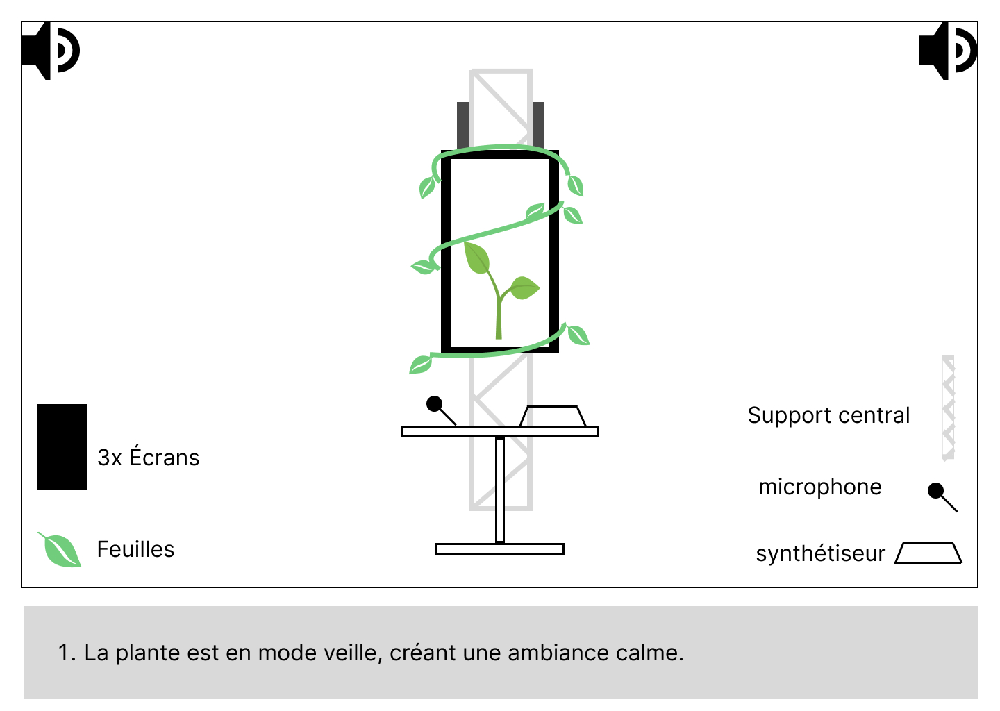

# Artistique

## **L’Espace et la scénographie**  
L’installation recrée un dialogue visuel et sonore entre la nature et la technologie :  
- **Décor hybride :** Des technologies  (écrans CRT, câbles, téléphones) recouvertes de plantes naturelles ou artificielles pour symboliser la coexistence entre ces deux mondes.  
- **Éclairage évolutif :** Des lumières qui changent subtilement selon l'état de la plante (lumières vives quand elle prospère, tamisées lorsqu’elle dépérit).
- **Plateforme centrale :** Une table minimaliste accueille le **Micro** et le **synthétiseur**, connectés à un écran affichant la plante numérique en 3D, évoluant en temps réel.  
- **Son spatialisé :** Quatre haut-parleurs positionnés dans les coins diffusent des sons naturels et mélodiques en réponse aux interactions.  


## **Interactivité**
1. **Croissance collaborative :**  
   - Les visiteurs utilisent des **M5Stack Button** pour jouer des sons en appuyant sur différents boutons et en inclinant l’appareil.  
   - Les sons produits influencent directement la plante : des mélodies harmonieuses favorisent sa croissance, tandis que des sons discordants peuvent ralentir ou stagner son développement.  

2. **Cycle de temps :**  
   - La plante pousse en temps réel sur un cycle continu (par exemple, une journée). Si les visiteurs interagissent régulièrement, elle atteint des stades de développement avancés (branches, fleurs, textures détaillées).  
   - Sans interaction, elle commence à se faner progressivement et revient à son état initial.  

3. **État collectif :**  
   - Tous les visiteurs participent sur la même plante : leur engagement collectif construit ou détruit son évolution.  

### Voici un diagramme d'intéractivité

````mermaid
flowchart TD


    %% Scénario interactif pour le projet
    subgraph "Interface Utilisateur"
        site["Site Web"]
    end

    subgraph "Installation Physique"
        mic["Microphone"]
        synth["Synthétiseur"]
        plant["Plante Physique"]
    end

    subgraph "Backend"
        server["Serveur"]
        stream["Diffusion en direct"]
    end

    %% Connexions
    %% Site Web interactions
    site -->|"Envoi de clips vocaux"| server
    server -->|"Transmission des clips\nvers le synthétiseur"| synth

    %% Interactions physiques
    mic ---|"Capture de l'ambiance sonore"| server
    synth ---|"Production sonore vers\nla plante"| plant
    plant ---|"Réaction et évolution\ndynamique"| stream

    %% Diffusion et feedback
    stream ---|"Diffusion en direct\nsur le site web"| site
    plant ---|"Retour visuel et sonore\naux utilisateurs"| site
````


### **Moodboard visuel :**  
- **Technologie recyclée :** Téléphones à cadran, claviers cassés, câblages emmêlés.  
- **Nature sauvage :** Plantes grimpantes, mousse et fougères s’insinuant dans les objets technologiques.  
- **Lumières douces et organiques :** Une atmosphère apaisante et immersive.  


### **Palette de couleurs :**  
- Tons verts et bruns naturels, contrastés par des nuances métalliques et noires de la technologie.


## **Expérience utilisateur**  
1. **Découverte :**  
   - En entrant, les visiteurs sont accueillis par un espace où la technologie abandonnée et la nature coexistent harmonieusement.  
2. **Interaction :**  
   - Les visiteurs interagissent avec la plateforme et observent les effets immédiats sur la plante.  
3. **Réflexion Collective :**  
   - En voyant l’impact de leur participation (ou absence de participation) sur la plante, les visiteurs réfléchissent à leurs propres relations avec le temps et l’attention, que ce soit dans le monde numérique ou naturel.  


## **Inspirations artistiques**
1. **Virgil Abloh :** Installation et design minimaliste mais percutant.  
2. **Studio Drift :** Œuvres connectant technologie et nature.  
3. **Olafur Eliasson :** Expériences immersives et visuelles.  

## **Scénarimage**
Voici un scénarimage démontrant l'intéractivité de l'installation.



## **Simulation**
Voici des rendues 3D de ce à quoi ressemblerait notre plante.

