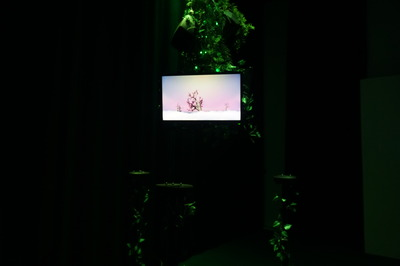

# FUGA
Fuga est une installation interactive où l'on peut créer son propre modèle d'arbre 3D personnalisée. Chaque interacteur a pour mission de manipuler un générateur de signaux fait maison pour produire des sons qui favorisent la croissance de l'arbre. Il faut donc expérimenter les fréquences et ajuster les paramètres du générateur pour trouver l'équilibre parfait. Le tout engendre un environnement visuel et sonore harmonieux ainsi qu'unique. Ce projet vise à démontrer que, lorsque la technologie est utilisée de manière responsable et réfléchie, elle peut soutenir et renforcer la nature. 

## Video d'intention

## Video bande-annonce

## Video finale

## Gallerie

* 
* 
* 
* 
* 
* 

