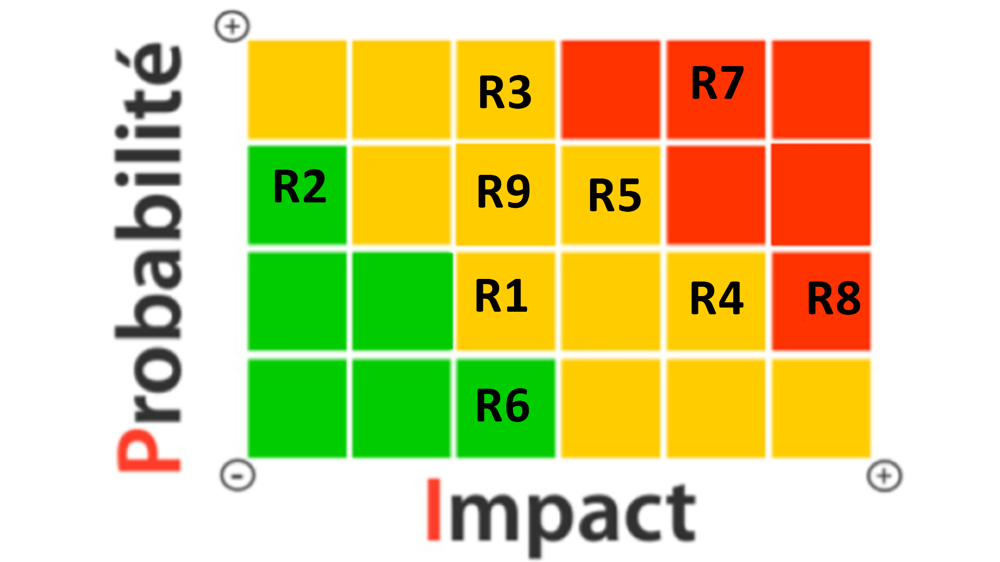

# Étude de risque

## Produit minimum viable

Interactivité
La plante évolue lorsqu’elle reçoit du son du microphone, du synthétiseur ou du site web.
Visuel
La plante est diffusée sur les trois écrans dans le studio et sur le site web.
Matériel
Pour le matériel voici une liste de ce que nous aurons de besoins.
-	Plante physique : pour intégrer visuellement la nature dans l'installation
-	M5Atom
-	Microphone
-	3 écrans : pour diffuser la plante
-	Haut-parleurs x4
-	Lumière : contrôlable avec qlc+
-	Caméra HD : pour capturer l'installation en direct.
-	Table minimaliste pour accueillir le matériel central.
-	Serveur et ordinateur pour le site web.
Sonore
Une ambiance sonore harmonieuse et mélodique avec des élément naturelle joue en continue et peut être agrémenté de son venant de l’interacteur.

https://escapism-fuga.github.io/Fuga/
Nos tests doivent être terminés pour le 13 février 2025.

## Matrice de risques

R1 : Les animations de la plante numérique risquent de ne pas être fluides ou visibles correctement sur l’écran/projecteur en raison de problèmes de résolution ou de luminosité ambiante.

R2 : Les boutons ou capteurs M5Stack risquent de ne pas détecter correctement les interactions des visiteurs (mauvais placement ou calibration).

R3 : Les visiteurs risquent de ne pas comprendre comment interagir avec la plante, ce qui peut limiter l’engagement.

R4 : Un mauvais placement des hauts-parleurs pourrait causer une saturation ou une diffusion spatiale non-optimale.

R5 : Le système de diffusion en direct peut échouer en raison d’une connexion Internet instable ou d’une surcharge réseau.

R6 : Le serveur risque de ne pas traiter les données en temps réel si le nombre d’interactions est trop élevé.

R7 : Les capteurs sonores risquent de ne pas capter les sons correctement si l’espace est trop bruyant ou mal isolé.

R8 : Risque de bris matériel (capteurs, haut-parleurs, câblage) lors de l’installation ou du démontage.

R9: La synchronisation entre Touch Designer, Max, et le matériel (capteurs, M5Stack) pourrait être compromise par des bugs logiciels ou des incompatibilités.

 
Pour éviter ces risques, nous devrons adopter une méthodologie rigoureuse alliant tests approfondis, planification et optimisation technique. Tout d'abord, il sera essentiel de tester les animations et la configuration des écrans dans des conditions similaires à l'installation finale (R1). La calibration des capteurs M5Stack devra être effectuée régulièrement, en tenant compte du placement optimal pour détecter les interactions (R2). Pour assurer l'engagement des visiteurs, des panneaux explicatifs et des démonstrations claires seront nécessaires (R3). Un test de qualité sonore et de positionnement des haut-parleurs sera réalisé pour éviter les interférences ou saturations (R4). Concernant la diffusion en direct, nous prévoyons une connexion Internet au Cegep qui pourrait donc recevoir beaucoup d’achalandage, mais celle du studio devrait être plus adaptée (R5). Le serveur devra être optimisé pour traiter un grand nombre d’interactions simultanées, avec des options d’évolutivité (R6). Pour gérer le bruit ambiant, l’espace sera aménagé avec des matériaux absorbants, comme des rideaux si nécessaire (R7). Une manipulation soignée et l’utilisation de pièces de rechange minimiseront les risques de bris lors de l’installation (R8). Enfin, des tests intensifs et une vérification des compatibilités logicielles entre Touch Designer, Max et le matériel garantiront une synchronisation fluide (R9).

